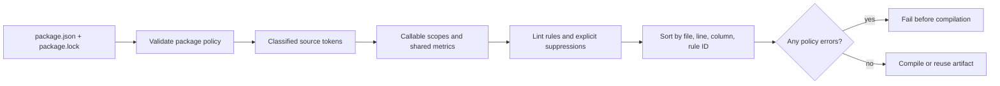

SIP-0006: Package Quality Pipeline

Status: Implementing (milestone 1)
Type: Compiler | Tooling | Package
Authors:
Created: 2026-09-13
Target:
Supersedes:
Superseded by:

## Summary

Severian lacks code coverage, linting, build pipelining, enforcing a default standard in the package library. We should also 
have go to definition, usages, and debugging functionality to inspect/review and watch variables while coding to catch bugs
faster


## Milestone 1 implementation

Package builds run `package.lint(project)` before compiling or reusing an
artifact. `sev build --lint` explicitly enables that pass for this invocation.
`sev check`, package tests, and package runs use the same execution boundary.
`sev options` prints the catalog-generated configuration without editing files.
`sev new` and `sev init` generate that configuration with lint enabled.



Manifests use **package.json** with JSON5 parsing rules. Comments, trailing commas, quoted or unquoted
keys, and single-quoted strings are accepted. The generated representation uses
quoted keys and strict JSON values, with explanatory `//` comments. Numeric
package options are bounded nonnegative integers. `package.lock` retains its
filename and contains generated JSON. Package metadata and compiler-session
records use `.json`. Cargo manifests, compiler configuration catalogs, and
historical protocol specifications are not Severian package manifests.
Legacy package TOML remains readable during migration; `package.json` takes precedence
when both names exist. Generated files use the new format.

```json5
{
  package: { name: 'quality-demo', version: '0.1.0' },
  bin: [{ name: 'quality-demo', path: 'src/main.sev' }],
  lint: {
    enabled: true,
    'file-lines': 999,
    'function-lines': 399,
    parameters: 6,
    'class-methods': 20,
    'match-arms': 9,
    'conditional-branches': 9,
    exclude: ['generated/'], // Exact package-relative file or directory prefix.
    rules: {
      L0003: 'error', // off | info | hint | warning | error
      L0006: 'hint',
    },
  },
  diagnostics: { 'message-format': 'text' }, // text | json
}
```

A limit is an **inclusive maximum**: 999 file lines and 399 callable lines pass;
1000 and 400 fail respectively. File lines include comments and blank lines.
Callable size counts source lines from `def` through its last body token.
Parameters exclude `self`; commas inside generic types or default expressions
do not create additional parameters. Class size measures declared direct
methods. Match and conditional metrics count direct cases and `if`/`elif`
branches, respectively.

| Rule | Metric | Default limit | Default severity |
| --- | --- | ---: | --- |
| L0001 | File source lines | 999 | warning |
| L0002 | Function/method source lines | 399 | warning |
| L0003 | Parameters excluding receiver | 6 | warning |
| L0004 | Unused locals, parameters, explicit imports, binary globals | 0 | warning |
| L0005 | Unreachable callables and statements after terminators | 0 | warning |
| L0006 | Direct class methods | 20 | hint |
| L0007 | Direct match cases | 9 | hint |
| L0008 | Conditional dispatch branches | 9 | hint |

Rules consume the compiler's classified lexer tokens. Strings and comments do
not count as symbol uses. Callable scopes isolate local-use checks. Package
reachability starts at `main`, top-level code/tests, exported/library APIs,
methods and decorated callables; function values count as references, including
callbacks. Statements after unconditional `return`, `throw`, `break`, or
`continue` in the same block are also reported. Same-name overloads and qualified uses conservatively keep candidates
live. This is conservative source analysis, not a proof that externally invoked
code can be deleted. Structural findings are suggestions; this milestone does
not implement responsibility inference, duplicate-code detection, churn,
profiling, coverage, or automatic refactoring.

```sev
# L0004: the parameter is never read; text in a string is not a use.
def greeting(unused_name: string):
    print("unused_name")

# Prefix an intentionally unused parameter with _.
def notification(_context: string):
    print("ready")

# Function values passed as callbacks remain reachable.
def notify():
    print("ready")

def invoke(callback: () -> unit):
    callback()

def main():
    invoke(notify)
```

Suppressions are explicit and non-destructive. Unknown rule IDs fail validation.
A whole-file directive can appear anywhere outside string literals. A next-line
directive only suppresses findings anchored on the immediately following line.

```sev
# sev-lint-next-line: allow L0003
def legacy_bridge(a: int, b: int, c: int, d: int, e: int, f: int, g: int):
    print(a, b, c, d, e, f, g)
```

```sev
import package

project = package.open(".")
for finding in package.lint(project):
    print(finding.rule, finding.file, finding.line, finding.measured)

# Generate complete options, preserving explicitly configured values.
print(package.options(project.manifest.entries))
```

Diagnostics include rule ID, package-relative path, start/end positions,
severity, measured value, threshold, explanation, and remediation. Positions
are one-based Unicode character locations; end positions are exclusive.
Text diagnostics go to stderr. JSON mode emits one diagnostic object per line
to stderr. Diagnostics sort by path, numeric line, numeric column, then rule ID.
Lint runs on every package execution, including artifact cache hits, so a cached
binary cannot bypass a newly tightened policy. Release builds run the same
static checks without adding instrumentation to generated code.

The focused regression suite is `test/validation/packages/quality`; CLI checks
are in `library/package/tests/quality.py`. Run the source compiler against the
suite after rebuilding it with the Rust seed. The Rust seed also reads JSON5
manifests so it can bootstrap the source compiler after migration.

## Appendix

| Term | Contract |
| --- | --- |
| `package.json` | User-authored identity, targets, dependencies, quality policy |
| `package.lock` | Generated JSON dependency resolution |
| `package.pkg/` | Generated artifacts and package metadata |
| `package.lint(Project)` | Returns ordered `list[LintDiagnostic]` without editing source |
| `package.options(list[Entry])` | Produces a complete commented package configuration |
| `LintRule` | Stable rule ID, metric option, default maximum, level and remediation |
| `LintDiagnostic` | Rule, source range, severity, measurement, maximum and remediation |
| `LintSource` | Classified tokens, source positions, callable scopes and suppressions |
| `Entry` | Format-independent package table/key/value record |
| `DocumentNode` | JSON5 node in an arena indexed by parent; `C` retains Container meaning |

## Context (list of items)

- Identify code
- Remove/find candidates quickly and allow A/B testing quickly
- 

## Problem(s)

Linting

- Long parameter lists
- God classes
- Large class
- Long method
- Large file (>1000 LOC)


- Switch abuse instead of polymorphism indexing dicts/maps
- Alternative Classes with Different Interfaces
- Divergent Change (Code churn means this class has change in the last 7/10 commits CODE SMELL)


### The Dispensables: Unnecessary clutter that impacts readability.

- Lazy Class / Freeloader: A class that does too little to justify its maintenance cost.
- Dead Code: Variables, functions, or files that are never called or executed.
- Speculative Generality: Writing complex scaffolding "just in case" it's needed in the future
- Standalone file that isn't exposed in the package --deprecate should propose/show code that has no output/is removed during compilation


### The Couplers: Excessive or inappropriate connections between classes.

- Middle Man: A class whose entire existence is simply delegating work to another class


### Test-Specific Smells: Design flaws present inside unit/integration tests.

- Assertion Roulette: A test containing multiple assertions without descriptive messages, making failure tracking difficult.
- Eager Test: A single test method checking multiple functionalities of production code at once.
- Mystery Guest: A test that depends on external data files or configurations to pass, hiding its true logic.

### Code Coverage & Testing Rigor 


- (Dynamic Level)Dynamic verification ensures that as the system runs, its codebase behaves correctly under explicit metrics.Coverage MetricDescriptionStatement / Line CoverageMeasures the percentage of individual source code lines executed during testing.- Branch / Decision CoverageEnsures every path at a control structure (e.g., both the true and false branches of an if statement) is tested.Function / Method CoverageTracks whether every defined function or method in the codebase has been called at least once.Condition CoverageEvaluates whether every boolean sub-expression in a complex conditional evaluates to both true and false.Path CoverageThe most rigorous standard; tests every conceivable linear path through a function from start to finish.Mutation TestingIntroduces intentional bugs ("mutants") into your code to see if your test suite successfully catches and fails them.


## Examples

* `sev build`

  * Run configured lint rules.
  * Run documentation validation.
  * Run coverage thresholds.
  * Run leak/allocation checks when enabled.
  * Emit deterministic diagnostics in source order.

Lint is defaulted on in the package with sev init. 
* `sev build --lint`

  * Flag files over 1000 LOC.
  * Flag methods over 400 LOC.
  * Flag excessive parameter counts.
  * Flag classes with excessive responsibilities.
  * Flag dead code and unused variables.
  * Flag duplicate implementations.
  * Flag middle-man classes.
  * Flag large `match` expressions.
  * Flag repeated conditional dispatch that could use a map, trait, or polymorphic operation.
  * Flag suspected speculative generality.
  * Flag churn hotspots.
  * Flag standalone files not exposed by the package.
  * Flag expensive allocation patterns.
  * Flag comments that only restate code.

Coverage is defaulted on
* `sev test --coverage`

  * Line coverage.
  * Branch coverage.
  * Function coverage.
  * Condition coverage.
  * Optional path coverage.
  * Optional mutation testing.

* Function documentation put in a ``` comment block:

  ```sev
   # Parses one source file into a syntax tree.
  
   # Parameters:
   # - source: Source text to parse.
  
   # Returns:
   # - Parsed syntax tree.
  
   # Errors:
   # - ParseError when source cannot satisfy the grammar.
  
   # Complexity:
   # - Runtime: O(n) Space: O(1/n) Cognitive Complexity

   # Notes/Description:

   # Example Usage:
   # - parse("def ...")
  def parse(source: string) -> Tree | ParseError:
      ...
  ```

* Class documentation:

  ```sev
   # Owns package dependency resolution.
  
   # Responsibilities:
   # - Resolve package versions.
   # - Validate dependency constraints.
   # - Produce the dependency graph.
  
   # Invariants:
   # - Graph contains no unresolved dependency.
   # - Package identity is unique.
  class Resolver:
      ...
  ```


* Editor:

  * Go to definition.
  * Find references/usages.
  * Go to implementation.
  * Call hierarchy.
  * Type hierarchy.
  * Hover documentation.
  * Parameter hints.
  * Return-type hints.
  * Inlay type hints.
  * Semantic highlighting.
  * Deprecated-code highlighting.
  * Dead-code dimming.
  * Complexity warnings.
  * Coverage gutters.
  * Breakpoints.
  * Step in/out/over.
  * Variable inspection.
  * Watch expressions.
  * Stack inspection.
  * Ownership/lifetime inspection.

## Illustration

* Source code flows through one quality pipeline:

  * Parse.
  * Resolve symbols.
  * Build semantic information.
  * Run static lint rules.
  * Build executable/tests.
  * Run tests.
  * Collect coverage.
  * Collect allocation/leak data.
  * Collect profiling data.
  * Compare results against package policy.
  * Emit diagnostics.
  * Expose results through CLI and editor.

* Diagnostics use one severity model:

  * `info`: informational metric.
  * `hint`: suggested simplification.
  * `warning`: quality threshold violated.
  * `error`: configured package policy violated.

* Every diagnostic contains:

  * Stable rule ID.
  * File.
  * Source range.
  * Explanation.
  * Measured value.
  * Configured threshold.
  * Suggested remediation.
  * Optional automatic fix.

* Quality rules are deterministic:

  * Same source + configuration produces the same diagnostics.
  * Rules operate on compiler facts where possible.
  * Git history rules use an explicit revision window.
  * No lint rule silently rewrites source.
  * Heuristic rules default to hints or warnings rather than errors.

## Testing

* Unit-test every lint rule with:

  * Passing example.
  * Failing example.
  * Boundary value.
  * Suppressed rule.
  * Package override.

* Golden diagnostic tests:

  * Stable diagnostic ID.
  * Stable source span.
  * Stable severity.
  * Stable message.
  * Stable suggested fix.

* Coverage tests:

  * Line coverage measurement.
  * Branch coverage measurement.
  * Function coverage measurement.
  * Condition coverage measurement.
  * Threshold pass.
  * Threshold failure.
  * Excluded/generated source handling.

* Documentation tests:

  * Public function missing documentation.
  * Public class missing documentation.
  * Parameter documentation mismatch.
  * Return documentation mismatch.
  * Error documentation mismatch.
  * Invalid documentation reference.
  * Documentation updated after signature changes.

* Editor tests:

  * Definition lookup.
  * Reference lookup.
  * Rename.
  * Hover.
  * Semantic tokens.
  * Inlay hints.
  * Diagnostics.
  * Breakpoints.
  * Variable watches.
  * Stack frames.

* Debugger tests:

  * Local variables.
  * Arguments.
  * Returned values.
  * Ownership state.
  * Moved values.
  * Borrowed values.
  * Mirror/view state.
  * Collection contents.
  * Source-to-generated-code mapping.

* Determinism test:

  * Run lint/build/test twice from the same source tree.
  * Require identical diagnostic ordering and results.

* Regression tests:

  * Quality tooling cannot change program semantics.
  * Disabling lint rules cannot change generated code.
  * Editor analysis cannot change compiler state.

## Performance

* Measure quality pipeline stages independently:

  * Parsing.
  * Semantic analysis.
  * Linting.
  * Coverage instrumentation.
  * Documentation indexing.
  * Editor indexing.
  * Debug metadata generation.

* Required properties:

  * Incremental analysis only revisits affected files.
  * Unchanged packages reuse cached quality results.
  * Editor diagnostics operate incrementally.
  * Coverage instrumentation is disabled for release builds unless requested.
  * Git-history analysis is cached by commit.
  * Duplicate-code analysis uses indexed representations rather than pairwise source comparison.

* Report:

  * Wall time.
  * CPU time.
  * Peak memory.
  * Allocation count.
  * Cache hits/misses.
  * Files/functions analyzed.

* Package policy may define:

  * Maximum lint overhead.
  * Maximum analysis memory.
  * Maximum incremental-analysis latency.

## Optimization

* Reuse compiler IR rather than reparsing source for lint rules.

* Attach quality metadata to existing symbols, functions, classes, CFGs, and packages.

* Compute shared metrics once:

  * LOC.
  * Cyclomatic complexity.
  * Parameter count.
  * Call count.
  * Allocation count.
  * Branch count.
  * Churn.
  * Coverage.

* Cache metrics by:

  * File hash.
  * Function hash.
  * Package version.
  * Compiler version.
  * Rule configuration.

* Re-run only checks affected by:

  * Changed source.
  * Changed dependencies.
  * Changed quality policy.
  * Changed compiler version.

* Prefer compiler-known facts over heuristics.

* Keep heuristic refactoring suggestions non-destructive.

* Allow profiling data to strengthen static warnings:

  * High allocation count.
  * Expensive hot path.
  * Large object lifetime.
  * Repeated conversion.
  * Excessive dispatch.

* Use editor analysis results from the same semantic database as `sev build` to prevent CLI/editor disagreement.

## Rollback Procedure

* All new quality checks begin as:

  * Disabled.
  * `info`.
  * `hint`.
  * Or `warning`.

* Promote rules to errors only after:

  * Compiler tests pass.
  * Package-library tests pass.
  * Existing packages are measured.
  * False-positive rate is acceptable.

* Every rule has:

  * Stable rule ID.
  * Package-level configuration.
  * Severity override.
  * Explicit suppression mechanism.

* Rollback options:

  * Disable individual rule.
  * Downgrade error to warning.
  * Disable coverage enforcement.
  * Disable mutation testing.
  * Disable expensive analysis.
  * Revert package quality profile.

* Rollback must not require source changes.

* Existing builds remain reproducible using their recorded quality configuration.

* Removed rules remain recognized as deprecated configuration keys for at least one migration period.

## Migration
1. Severian manifests use `package.json` with comment support; Cargo files retain their native TOML format.
2. Generated `package.json` files use the default options with comments listing supported values. `package.options` keeps generated configuration aligned with the option catalog. 
3. All builds should have limits for LOC <1000, code/branch coverage > 90% and no dead code/unused variables as warnings as well as a O(...) notation for functions etc. which allows for cleaner profiling testing and better optimizations
4. Methods should be smaller than 400 LOCs. 
5. Matches should have less than 10 cases otherwise they should be a dict/map lookup
6. Expensive/long running code with many allocations should be flagged
7. Leaks should be flagged and cause compiler errors per an option
8. Old code might be killable, looking at LOC written early will give hints to TODO/leftover work
9. New code might be in progress and also killable worth looking into
10. Duplicate functionality should be flagged and collapsed/refactored
11. Comment blocks are helpful for understanding the code. We should have comment blocks like that with notes etc. 
12. Remove pointless comments
13. stacked if statements for handling are the same as match
14. Finish implementing the examples/testing for all those cases and add testing for those throughout the compiler

## Deprecation
N/A should not result in deprecations

## Milestones (max 5)

1. `sev build` runs the configured lint pipeline from package policy.

   * LOC/file limits.
   * Method/function size limits.
   * Parameter-count limits.
   * Dead code and unused symbols.
   * Structural smells.
   * Stable rule IDs and deterministic diagnostic ordering.
   * Use JSON5 package manifests and generated JSON locks/metadata, with legacy readers during migration.

2. `sev test` produces enforceable quality metrics.

   * Line coverage.
   * Branch coverage.
   * Function coverage.
   * Condition coverage.
   * Package-defined thresholds.
   * Leak/allocation checks where enabled.

3. Documentation becomes compiler-checked metadata.

   * Public functions require parameter, return, error, and complexity docs.
   * Public classes require purpose, responsibilities, and invariants.
   * Signature changes invalidate stale documentation.
   * Documentation is available to tooling and generated package docs.

4. Editor tooling uses the same semantic data as the compiler.

   * Go to definition.
   * Find usages.
   * Go to implementation.
   * Hover docs.
   * Inlay hints.
   * Semantic highlighting.
   * Dead/deprecated code highlighting.
   * Coverage gutters.
   * Inline lint diagnostics.

5. Debugging and quality analysis form one deterministic feedback loop.

   * Breakpoints and stepping.
   * Variable/watch inspection.
   * Stack inspection.
   * Ownership/borrow/view/mirror inspection.
   * Allocation and performance warnings.
   * Churn and duplicate-code analysis.
   * Incremental caching so unchanged packages are not reanalyzed.
